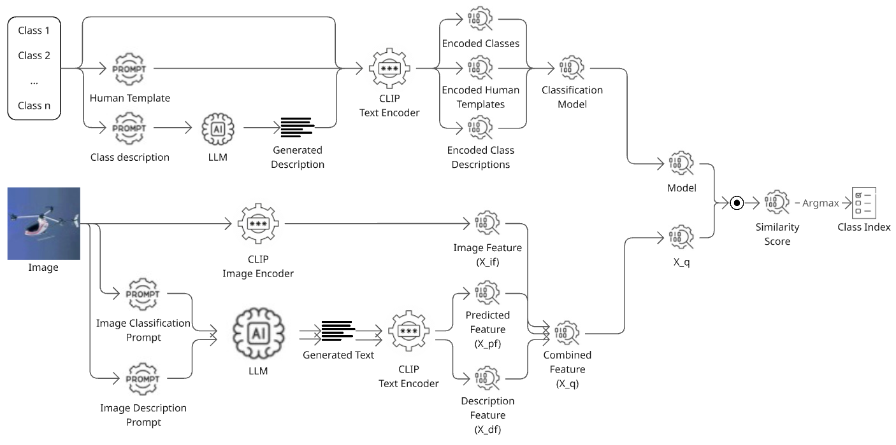
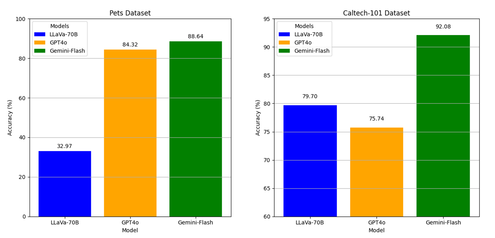

## Benchmarking Multimodal Large Language Models for Image Classification

**Tuan Nguyen**  
Neural Networks and Deep Learning  
University of Colorado Boulder  
tuan.nguyen@colorado.edu

---

Recent Multimodal Large Language Models (MLLMs) show strong potential for solving vision-language tasks, particularly image classification. Several studies have demonstrated that zero-shot classification approaches can outperform traditional methods. 

This project benchmarks the image classification performance of both proprietary and open-source MLLMs, including Gemini Flash, GPT-4o, and LLaVA-70B, using the Pets and Caltech-101 datasets. We evaluate different prompting techniques, comparing the effects of zero-shot prompting versus Chain of Thought prompting. Our results highlight the contribution of each component in zero-shot image classification algorithms and reveal performance differences across models under both default and advanced prompting strategies.

